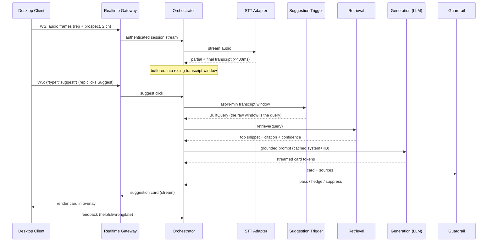
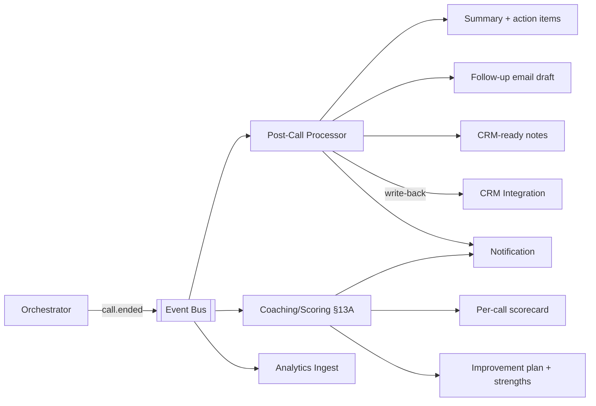
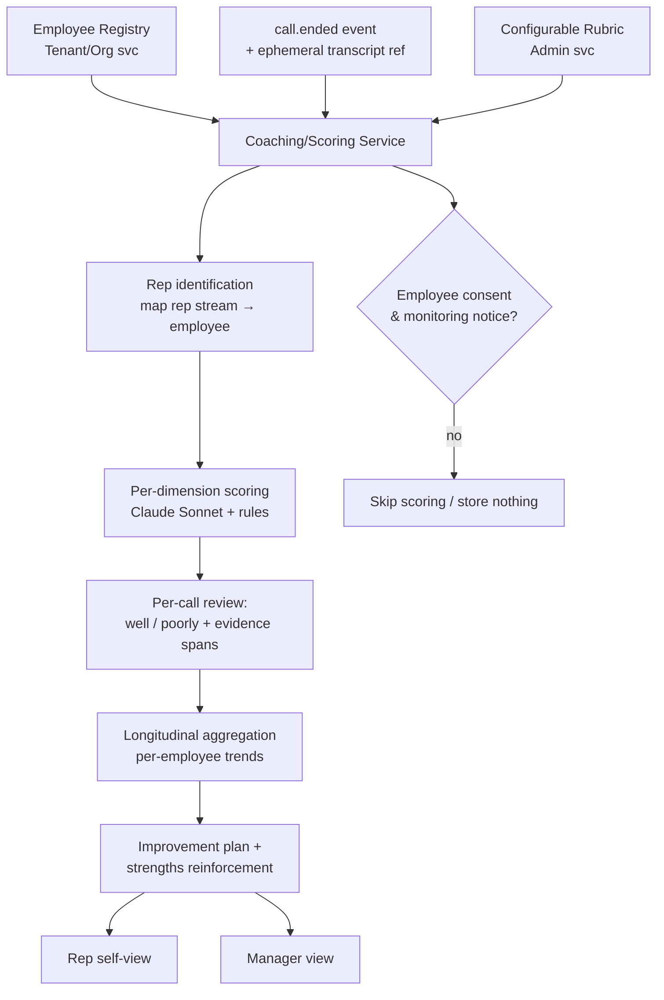

# Technical Architecture — Real-Time AI Sales-Call Copilot

**Audience:** engineering, infra, security. **Companion docs:** [`README.md`](./README.md)
(what), [`FEATURES.md`](./FEATURES.md) (feature inventory, referenced by ID),
[`ROADMAP.md`](./ROADMAP.md) (build order).

> **What this document answers:** How do we build it? Is it microservices — and if
> so, which parts? What is the real-time pipeline, the data architecture, the AI
> stack, the security/compliance model, and the deployment topology? Concrete tech
> choices are made and justified; alternatives are noted as ADRs at the end.

---

## Table of contents
1. [Architectural drivers (the constraints that shape everything)](#1-architectural-drivers)
2. [Architecture style: is this microservices?](#2-architecture-style-is-this-microservices)
3. [System context & high-level architecture](#3-system-context--high-level-architecture)
4. [Service decomposition](#4-service-decomposition)
5. [The real-time path (the hard part) + latency budget](#5-the-real-time-path--latency-budget)
6. [The asynchronous / post-call path](#6-the-asynchronous--post-call-path)
7. [AI / ML subsystem](#7-ai--ml-subsystem)
8. [The §13A Per-Employee Coaching Engine](#8-the-13a-per-employee-coaching-engine)
9. [Data architecture](#9-data-architecture)
10. [Desktop client architecture](#10-desktop-client-architecture)
11. [API design](#11-api-design)
12. [Eventing & messaging](#12-eventing--messaging)
13. [Multi-tenancy](#13-multi-tenancy)
14. [Security architecture](#14-security-architecture)
15. [Compliance & data governance](#15-compliance--data-governance)
16. [Observability](#16-observability)
17. [Deployment & infrastructure](#17-deployment--infrastructure)
18. [Scalability & capacity planning](#18-scalability--capacity-planning)
19. [Tech stack summary](#19-tech-stack-summary)
20. [Build vs. buy](#20-build-vs-buy)
21. [Architecture Decision Records (ADRs)](#21-architecture-decision-records-adrs)

---

## 1. Architectural drivers

Everything below is shaped by these non-functional requirements (NFRs):

| Driver | Requirement | Architectural consequence |
| --- | --- | --- |
| **Latency** | STT partials <400 ms; **end-to-end suggestion 2–4 s** | Minimize network hops on the hot path; co-locate hot-path services; stream, don't batch; aggressive caching; prompt caching. |
| **Accuracy / groundedness** | Wrong-answer <5% (≈0 on pricing/security) | Strict RAG with source-only answering; guardrail service; eval harness in CI. |
| **Reliability** | A crash mid-call is worse than no tool | Graceful degradation; the hot path survives if async services are down; circuit breakers. |
| **Privacy / compliance** | Consent-gated; "no-recording" mode; no-train default; data residency | Consent enforced at session start; audio-ephemeral by default; per-tenant data isolation; regional deployments. |
| **Multi-tenancy** | Many companies, isolated data | Tenant ID propagated everywhere; row-level + namespace isolation; per-tenant KB indexes. |
| **Cost** | STT + LLM dominate COGS | Metering on the hot path; tiered models (cheap/fast for live, stronger for async); caching. |
| **Scale** | Thousands of concurrent live calls | Horizontally scalable stateless workers; session affinity at the gateway only. |
| **Elastic + bursty** | Calls cluster in business hours/time-zones | Autoscaling; provider abstraction to spread STT/LLM load. |

**The golden rule:** the **hot path** (live audio → suggestion card) is optimized for
latency and reliability above all. The **control plane** (auth, billing, admin,
analytics) and **async path** (post-call, coaching) are optimized for correctness,
auditability, and cost — they can be richer and slower.

---

## 2. Architecture style: is this microservices?

**Yes — but a *pragmatic, coarse-grained* service architecture, not fine-grained
microservices.** We deliberately split the system into three planes, and only
decompose where there is a real scaling, latency, language, or team boundary.

### 2.1 The three planes

```
┌──────────────────────────────────────────────────────────────────────┐
│  CONTROL PLANE  (request/response, can be slower, must be correct)     │
│  Auth · Tenant/Org · Admin/Playbook · Knowledge/Ingestion · Billing ·  │
│  CRM Integration · Analytics API · Consent/Compliance                  │
├──────────────────────────────────────────────────────────────────────┤
│  REAL-TIME PLANE  (the hot path — latency is king, keep hops minimal)  │
│  Realtime Gateway · Call Session Orchestrator · STT Adapter ·          │
│  Suggestion Trigger · Retrieval · Suggestion/Generation · Guardrail    │
├──────────────────────────────────────────────────────────────────────┤
│  ASYNC / DATA PLANE  (event-driven, throughput over latency)           │
│  Post-Call Processor · Coaching/Scoring (§13A) · Notification ·        │
│  Analytics Ingest · Eval/Telemetry                                     │
└──────────────────────────────────────────────────────────────────────┘
```

### 2.2 Why not a single monolith, and why not 40 nano-services

- **Why split at all:** the three planes have *opposite* optimization targets
  (latency vs. correctness vs. throughput) and different scaling curves (a live call
  pins resources on STT/LLM streaming for minutes; an admin save is microseconds).
  Forcing them into one deployable couples release cadence and blast radius. (Note:
  the split is about **boundaries, not languages** — the whole backend is **Go**;
  see [ADR-002](#21-architecture-decision-records-adrs).)
- **Why not fine-grained microservices:** every network hop on the hot path costs
  latency we cannot spare against a 2–4 s budget. Over-decomposition (separate
  services for "tokenizer," "embedder," "reranker," etc.) would add 50–150 ms per
  hop and operational sprawl. So within the real-time plane we keep services
  **coarse and co-located** (same cluster, same AZ, gRPC over the cluster network),
  and we let the **orchestrator** call them in-process where it makes sense.

### 2.3 The rule we apply for "should this be its own service?"

Split a capability into its own service only if **at least one** is true:
1. It scales on a *different* axis (e.g., STT scales with concurrent-call-minutes;
   ingestion scales with doc volume).
2. It has a *different* availability/latency SLO (hot path vs. nightly analytics).
3. It's a *clear* compliance/security boundary (consent, billing).
4. A *different team* owns it and release independence matters.

Otherwise it stays a module inside an existing service. (This is "right-sized
services," and we start MVP closer to a **modular monolith per plane**, peeling out
services as the rules above trigger — see [ADR-001](#21-architecture-decision-records-adrs).)

---

## 3. System context & high-level architecture

```mermaid
flowchart TB
    subgraph Client["Desktop Client (Electron)"]
        CAP[Audio Capture\nmic + system loopback]
        OV[Overlay UI\nalways-on-top]
        WSendpoint[WS client]
    end

    subgraph Edge["Edge"]
        LB[API Gateway / LB\nTLS, authz, rate limit]
        RTG[Realtime Gateway\nWebSocket, session affinity]
    end

    subgraph RT["Real-Time Plane (Go, gRPC)"]
        ORCH[Call Session Orchestrator]
        STT[STT Adapter\n→ Deepgram/AssemblyAI]
        DET[Suggestion Trigger\nbutton → transcript window]
        RET[Retrieval Service\nRAG]
        GEN[Suggestion/Generation\nLLM orchestration]
        GRD[Guardrail Service]
    end

    subgraph CP["Control Plane (Go)"]
        AUTH[Auth/Identity]
        ADMIN[Admin/Playbook]
        KB[Knowledge/Ingestion]
        BILL[Billing/Metering]
        CRM[CRM Integration]
        ANA[Analytics API]
        CONS[Consent/Compliance]
    end

    subgraph ASYNC["Async/Data Plane"]
        PCP[Post-Call Processor]
        COACH[Coaching/Scoring §13A]
        NOTIF[Notification]
        EVAL[Eval/Telemetry]
    end

    subgraph DATA["Data Stores"]
        PG[(PostgreSQL\n+ pgvector)]
        REDIS[(Redis\ncache/session)]
        OBJ[(Object Store\nS3)]
        BUS[[Event Bus\nNATS/Kafka]]
        CH[(ClickHouse\nanalytics/telemetry)]
    end

    EXT[STT / LLM providers\nDeepgram · Anthropic Claude]
    EXTCRM[HubSpot / Salesforce]

    CAP --> WSendpoint --> RTG
    OV <-- cards --- RTG
    LB --> AUTH & ADMIN & KB & BILL & CRM & ANA & CONS
    RTG --> ORCH
    ORCH --> STT --> EXT
    ORCH --> DET --> RET --> GEN --> GRD --> ORCH
    GEN --> EXT
    RET --> PG & REDIS
    KB --> PG & OBJ
    ORCH -- events --> BUS
    BUS --> PCP & COACH & NOTIF & EVAL & ANA
    PCP --> GEN
    COACH --> PG
    CRM --> EXTCRM
    ANA --> CH
    AUTH --> PG
    BILL --> PG
```

---

## 4. Service decomposition

> **All backend services are written in Go** (see [ADR-002](#21-architecture-decision-records-adrs)).
> The AI work here is *orchestration around bought APIs* (STT, LLM, embeddings) — a
> networking job Go does best — not in-process model inference, so there is no need
> for a second language. If we later choose to **self-host** a model (embeddings,
> reranker, or a fine-tuned classifier), that single component may be introduced as
> a Python sidecar on the **async plane only** — never on the hot path.

### Real-Time Plane

| Service | Responsibility | Scaling axis | Key deps |
| --- | --- | --- | --- |
| **Realtime Gateway** | Terminate client WebSocket, authn the session, enforce consent gate, session affinity, backpressure | concurrent calls | Auth, Consent |
| **Call Session Orchestrator** | The conductor of one live call: owns session state, fans audio to STT, on a **Suggest** click drives trigger→retrieve→generate→guardrail, pushes cards to client, emits events | concurrent calls | all RT services |
| **STT Adapter** | Provider-agnostic streaming STT (Deepgram/AssemblyAI/Gladia/ElevenLabs), keyterm boosting, two-stream diarization passthrough | call-minutes | external STT |
| **Suggestion Trigger** | On a manual **Suggest** click: read the last-N-min transcript window from the Redis store and emit it as the retrieval query (`BuiltQuery`). No LLM, no automatic detection. | clicks per call | Redis (transcript store) |
| **Retrieval Service** | Conversation-aware query build → hybrid search over tenant KB → rerank → confidence score; returns cited snippets or nothing | query rate | pgvector/Qdrant, Redis, embeddings API |
| **Suggestion/Generation** | LLM orchestration: build grounded prompt (snippet + context), generate short card, stream tokens, cite sources | LLM calls | Anthropic Claude (API) |
| **Guardrail Service** | Groundedness check, "do-not-say" rule match, confidence gate, PII/sensitive filter before display | per-suggestion | rules + cheap LLM check |

### Control Plane
All Go.

| Service | Responsibility |
| --- | --- |
| **Auth/Identity** | Sign-up, OAuth, sessions, SSO/SAML/OIDC (V2), RBAC |
| **Tenant/Org** | Orgs, teams, seats, roles, employee registry (§13A) |
| **Admin/Playbook** | Objection→response, battlecards, do-not-say rules, methodology config, approval workflow |
| **Knowledge/Ingestion** | Upload/connectors (Drive/Notion/URL), parse, chunk, embed (via embeddings API), version, index per tenant |
| **Billing/Metering** | Usage metering (minutes), plans, Stripe, fair-use/overage, seat mgmt |
| **CRM Integration** | HubSpot/Salesforce OAuth, field mapping, post-call write-back, context pull |
| **Analytics API** | Dashboards, usage, usefulness, content-gap, manager analytics |
| **Consent/Compliance** | Consent records, retention policies, delete-on-request, residency, audit log |

### Async / Data Plane

| Service | Responsibility | Trigger |
| --- | --- | --- |
| **Post-Call Processor** | Summary, action items, follow-up email, CRM-ready notes, unanswered-question capture | `call.ended` event |
| **Coaching/Scoring (§13A)** | Per-call scored review, longitudinal aggregation, improvement plan, strengths, rubric scoring | `call.ended` event |
| **Notification** | Slack/Teams/email delivery of summaries, alerts, coaching reports | events |
| **Eval/Telemetry** | Groundedness/latency eval, feedback aggregation, regression detection | streaming + batch |

---

## 5. The real-time path & latency budget

### 5.1 Sequence of one suggestion



### 5.2 Latency budget (target ≤3 s, hard ceiling 4 s)

| Stage | Budget | Technique to hold it |
| --- | --- | --- |
| Audio frame → STT final for the turn | 300–400 ms | streaming STT, low min-silence (buffered continuously into the window) |
| Window read (Suggest click → BuiltQuery) | < 10 ms | two Redis reads on the transcript store; no LLM in the trigger path (`3.3` dropped) |
| Ask extraction (window → search query) | 200–500 ms | the ONLY query-side LLM call (`5.2`, Groq/Llama by default); small prompt, ~30-token output; no second "refine" call — per suggestion it's 2 LLM calls total: this + generation |
| Retrieval (search + rerank) | 150–400 ms | pre-embedded KB, ANN index, Redis cache of hot Q&A, cross-encoder rerank only on top-k |
| Generation (first useful token → full card) | 600–1500 ms | **fast model (Claude Haiku)**, **prompt caching** of system + KB context, **streaming** render, capped output tokens |
| Guardrail | 30–100 ms | rule match + cheap groundedness check; parallelize with first-token stream |
| Transport + render | 50–150 ms | persistent WS, pre-warmed overlay, render first bullet on first token |
| **Total** | **~1.4–3.2 s typical** | leaves headroom under the 4 s ceiling |

**Hot-path rules:**
- The orchestrator and RT services live in the **same cluster + AZ**; calls are gRPC,
  not HTTP/JSON.
- The transcript is **buffered continuously** so a **Suggest** click finds the window
  ready; the latency clock starts at the click, not at audio. The rep clicks when the
  question is asked, so there is no end-of-turn guessing.
- Generation **streams**; the overlay shows bullet 1 while bullet 2 is still
  generating (perceived latency ≈ time-to-first-token).
- **Prompt caching**: the tenant's system prompt + frequently used KB context are
  cached at the LLM provider, cutting input cost and time-to-first-token.
- **Caching**: a Redis layer caches embeddings of recent turns and full
  card-results for common objections (`5.9`).
- **Degradation**: if generation is slow/unavailable, fall back to showing the raw
  retrieved snippet + citation (still useful, still grounded).

---

## 6. The asynchronous / post-call path

When the call ends, the orchestrator emits `call.ended` (with the ephemeral
transcript reference) to the event bus. Consumers run independently:



- **Idempotent** consumers keyed by `call_id` (events may be redelivered).
- Heavier models (Claude Sonnet/Opus) are used here — quality over latency.
- Respects the call's consent/retention settings: if "no-recording," only the
  ephemeral transcript (and derived, redacted artifacts) are used, then purged per
  policy.

---

## 7. AI / ML subsystem

This is the product's core. Four cooperating components, each independently
evaluable and swappable.

### 7.1 Speech-to-Text (STT)
- **Buy, don't build.** Streaming providers behind a provider-agnostic adapter
  (`2.10`): **Deepgram Nova/Flux**, **AssemblyAI Universal-3**, **Gladia**,
  **ElevenLabs Scribe v2** — selected per latency/cost/accuracy and used as
  failover.
- **Diarization** primarily comes from the **two physical channels** (rep mic vs.
  system loopback) — cheaper and more reliable than ML diarization; ML diarization
  is the fallback for single-stream sources.
- **Keyterm boosting** (`2.6`) feeds product/competitor names per tenant.
- WebSocket streaming; every **final** is written through to the per-session Redis
  transcript store that the Suggest trigger reads its window from
  (`transcript_store_techdoc.md`).

### 7.2 Suggestion Trigger (the "Suggest" button)
- **Manual trigger — no automatic detection.** The rep clicks **Suggest** in the
  overlay; nothing surfaces otherwise. This removes the flappy "when did the question
  end / is this an objection" problem — the human decides the moment.
- On a click: read the **last N minutes** of transcript (configurable,
  `SUGGEST_LOOKBACK_MS`) from the per-session **Redis transcript store** — one sorted
  set per call holding the complete conversation, expired by a sliding TTL after the
  call goes quiet — and emit that window as the **retrieval query** (`BuiltQuery`).
  No LLM in the trigger (`3.3` dropped).
- The only "gating" is a per-session **in-flight guard + min-interval** (`3.11`) so a
  double-click doesn't fire two turns.
- **No proactive/auto layer — permanently.** There is no listener that surfaces on its
  own; the button is the only live trigger. Signals that would need live detection
  (buying-signal, discovery-gap, sentiment, talk-ratio) are **post-call** analysis, not
  in the hot path.

### 7.3 Retrieval (RAG)
- **Per-tenant index.** Ingested docs are chunked, embedded, and stored in
  **pgvector** (MVP) → **Qdrant** (scale). Hybrid search = vector + BM25/keyword
  (`5.2`) with a **cross-encoder reranker** on the top-k (`5.7`).
- **Query** arrives as the Stage-3 raw transcript window (`BuiltQuery`). The retrieval
  service's **first, mandatory step** is LLM extraction (`5.3`): a small model call that
  distills the window into "what the prospect is asking or objecting to" — handling
  multi-question windows, objections that aren't grammatical questions, and STT
  disfluency uniformly — and only that extracted ask is embedded and searched.
- **Confidence scoring** (`5.6`) and **"answer only from approved docs"** (`5.5`):
  below threshold → return nothing rather than hallucinate.
- **Citations** are first-class: every returned chunk carries `doc_id`, version,
  and span for display (`5.4`).

### 7.4 Generation & Guardrails
- **LLM: Anthropic Claude**, tiered by path:
  - **In-call cards → Claude Haiku 4.5** (lowest latency).
  - **Post-call summaries / coaching → Claude Sonnet 4.6** (quality).
  - **Deep analysis (win/loss, content gaps) → Claude Opus 4.8** (reasoning).
- **Prompt caching** of the per-tenant system prompt + stable KB context for
  time-to-first-token and cost.
- **Grounded prompting**: the model is given *only* retrieved, cited snippets and
  instructed to answer from them or abstain.
- **Guardrail service** (post-generation, pre-display): (1) groundedness check —
  does the card's claim trace to a cited source? (2) **do-not-say** rule match
  (`6.5`); (3) confidence gate (`18.9`); (4) PII/sensitive filter (`18.11`). Fails
  → hedge or suppress.
- **Eval harness** (`18.3`, `18.4`) runs groundedness + latency regressions in CI on
  a labeled corpus of recorded objections; prompt/model changes are versioned and
  rollback-able (`18.7`).

### 7.5 Model abstraction
A thin **LLM/STT gateway** wraps providers so we can swap models, A/B them, enforce
per-tenant data-handling (no-train flags, region pinning), and centralize
cost/latency telemetry (`18.6`, `18.8`).

---

## 8. The §13A Per-Employee Coaching Engine

A dedicated **async service** (correctness > latency) plus a small real-time hook.



- **Consent gate first** (`13A.19`, `13A.20`): no score is computed or stored unless
  the employee is registered and has the monitoring notice/consent. This is enforced
  in the service, not just the UI.
- **Scoring**: each rubric dimension (`13A.4`) is scored by a mix of deterministic
  signals (talk-ratio, monologue length, methodology-field coverage, did-not-say
  violations) and an LLM judge with **evidence spans** (`13A.6`) — so feedback is
  specific and auditable, never a black-box number.
- **Longitudinal store**: per-employee, per-dimension time series in Postgres (and
  rolled up to ClickHouse for trend/benchmark queries) → trends (`13A.7`), progress
  (`13A.10`), benchmarks (`13A.13`), regression alerts (`13A.14`).
- **Outputs**: per-call review, improvement plan, strengths, rep self-view, manager
  view, team-skill report — all derived, never exposing raw audio.

---

## 9. Data architecture

### 9.1 Stores and what lives where

| Store | Purpose | Why |
| --- | --- | --- |
| **PostgreSQL** | System of record: orgs, users, employees, seats, playbooks, consent records, billing, call metadata, scores | ACID, relational, mature; row-level security for tenancy |
| **pgvector → Qdrant** | KB embeddings for RAG | pgvector keeps MVP simple (one DB); Qdrant when index size/QPS demands |
| **Redis** | Hot-path cache: recent-turn embeddings, common-objection card cache, session state, rate limits | sub-ms reads on the latency-critical path |
| **Object store (S3)** | Documents, optional recordings/transcripts (consent-gated, lifecycle-expired) | cheap, durable, lifecycle policies for retention |
| **Event bus (NATS or Kafka)** | Decouple real-time from async; `call.*`, `doc.*`, `consent.*` events | NATS for low-latency/simplicity; Kafka if we need long retention/replay |
| **ClickHouse** | Analytics + telemetry: usage, usefulness, latency, coaching trends, benchmarks | columnar, fast aggregation over huge event volumes |
| **Secrets manager** | API keys, CRM tokens, signing keys | KMS-backed, rotated |

### 9.2 Data classification & lifecycle
- **Ephemeral by default**: live audio is a stream, never written to disk in
  "no-recording" mode (`14.3`, `1.12`). Transcripts exist only in memory/Redis for
  the call's duration unless retention is enabled.
- **Tiers**: `public` (marketing) · `internal` (app/config) · `customer-content`
  (KB docs, transcripts) · `personal-data` (names, voice, PII) · `secret` (keys).
- **Retention** (`14.5`) and **delete-on-request** (`14.6`) are policy-driven and
  cascade across Postgres, S3, ClickHouse, and vector indexes via `consent.delete`
  events.

### 9.3 Core entities (simplified)
```
Org 1─* Team 1─* Employee/User      Org 1─* KnowledgeDoc 1─* Chunk(+embedding)
Org 1─* Playbook 1─* {ObjectionRule, Battlecard, DoNotSayRule}
Call ─1 Org, ─1 Employee(rep)  ─* SuggestionEvent ─* Feedback
Call ─1 ConsentRecord          ─0..1 Recording/Transcript(consent-gated)
Call ─0..1 PostCallSummary     ─0..1 CoachingScorecard ─* DimensionScore(+evidence)
Employee 1─* CoachingTrend(time series)   Subscription ─1 Org ─* UsageMeter
```

---

## 10. Desktop client architecture

- **Framework:** Electron + TypeScript + React for UI; native modules for audio.
- **Audio capture:**
  - **macOS:** CoreAudio **Tap API** for system audio (Electron ≥ v39 default);
    mic via standard input. Requires screen/system-audio recording permission.
  - **Windows:** **WASAPI loopback** for system audio; mic via WASAPI capture.
  - Two independent streams (rep mic, prospect system audio) → encoded (Opus) →
    streamed over WebSocket.
- **Overlay:** a separate always-on-top, frameless `BrowserWindow` with
  **`setContentProtection(true)`** → `WDA_EXCLUDEFROMCAPTURE` (Windows) /
  `NSWindowSharingNone` (macOS) so it's invisible to screen-share (rep-private),
  paired with an explicit in-call **disclosure** that AI assistance is active
  (`7.7`, `7.7a`).
- **Resilience:** local ring buffer + reconnect (`1.11`); instant **pause** kills
  capture immediately (`1.8`).
- **Updates:** auto-update channel (`20.2`); crash reporting (`20.3`).
- **Browser extension (V1):** lightweight Chrome/Edge extension reading Meet native
  captions as a low-friction alternative (`1.9`).

---

## 11. API design

| Surface | Protocol | Used by | Notes |
| --- | --- | --- | --- |
| **Client real-time** | **WebSocket** (audio up, cards down) | Desktop client ↔ Realtime Gateway | binary audio frames; JSON control + card messages |
| **Client control** | **REST/JSON** (or GraphQL for dashboards) | Desktop + web app | auth, KB upload, playbook, settings, analytics |
| **Internal service-to-service** | **gRPC** (protobuf) | hot-path + control plane | typed, low-overhead, fast on hot path |
| **Eventing** | **NATS/Kafka** topics | async plane | `call.*`, `doc.*`, `consent.*`, `coaching.*` |
| **Public API + webhooks (V2)** | REST + signed webhooks | customers/partners | rate-limited, scoped tokens (`10.9`) |
| **Integrations** | provider SDKs/OAuth | CRM, calendar, Slack | per-tenant tokens in secrets mgr |

API conventions: versioned (`/v1`), tenant-scoped via auth context, idempotency keys
on writes, cursor pagination, problem+json errors, per-tenant rate limits at the
gateway.

---

## 12. Eventing & messaging

- **Why an event bus:** decouples the latency-critical orchestrator from the
  heavier async consumers (post-call, coaching, analytics). The orchestrator's job
  ends when it emits `call.ended`; it never waits on summarization.
- **Key topics:** `call.started` / `call.ended` / `suggestion.shown` /
  `suggestion.feedback` / `doc.ingested` / `consent.recorded` / `consent.delete` /
  `coaching.scored`.
- **Guarantees:** at-least-once delivery; idempotent consumers keyed by entity id;
  dead-letter queues; replay (Kafka) for analytics backfill.
- **Choice:** start with **NATS JetStream** (low latency, simple ops); migrate
  high-retention/replay topics to **Kafka** if/when needed (ADR-005).

---

## 13. Multi-tenancy

- **Shared infrastructure, isolated data.** A `tenant_id` (org) is in every request
  context, every row, every event, every KB namespace, every cache key.
- **Postgres:** Row-Level Security policies keyed on `tenant_id`; the app sets the
  tenant on each connection/transaction.
- **Vector index:** per-tenant namespace/collection so retrieval can never cross
  tenants.
- **Object store:** per-tenant prefixes + bucket policies.
- **Noisy-neighbor control:** per-tenant rate limits and usage metering at the
  gateway; heavy tenants can be pinned to dedicated worker pools.
- **Enterprise (V2):** optional **regional deployment** (EU/India data residency,
  `14.9`) and, for the most sensitive, **single-tenant/VPC** deployment (`15.8`).

---

## 14. Security architecture

- **Transport:** TLS 1.3 everywhere (client↔edge and service↔service via mTLS in the
  mesh).
- **At rest:** AES-256; KMS-managed keys; envelope encryption for customer content.
- **AuthN:** OAuth/OIDC for users; **SSO/SAML** for enterprise (V2); short-lived
  signed session tokens; mTLS service identities.
- **AuthZ:** **RBAC** (admin/manager/rep) enforced in services, not just UI;
  tenant-scoped; least-privilege service accounts.
- **Secrets:** central secrets manager (KMS-backed), rotation, no secrets in code/env
  files.
- **Data minimization:** ephemeral audio; redact PII in transcripts (`2.8`) and at
  rest (`15.7`); filter sensitive data before LLM calls (`18.11`).
- **Tenant isolation:** as §13; verified by tests that attempt cross-tenant access.
- **App security:** input validation, output encoding, dependency scanning, SAST/DAST
  in CI, secrets scanning.
- **Audit:** immutable **audit log** (`15.3`) of access, exports, deletions, consent
  changes.
- **Compliance program:** **SOC 2 Type II** (`15.5`), pen-testing (`15.10`), DPAs
  (`14.11`), vendor risk reviews for STT/LLM providers.
- **LLM/STT data handling:** providers configured for **no-training** on our data by
  contract + flag (`14.12`); region-pinned endpoints where required.

---

## 15. Compliance & data governance

Compliance is enforced **in the architecture**, not as policy docs:

| Control | Where it lives |
| --- | --- |
| Consent gate before capture | Realtime Gateway checks Consent service before the orchestrator starts STT (`14.1`, `14.2`) |
| No-recording mode | Orchestrator never persists audio; transcript stays in-memory/Redis TTL (`14.3`, `14.4`) |
| Retention & deletion | Consent service drives lifecycle across all stores via `consent.delete` (`14.5`, `14.6`) |
| Consent logs | Immutable records per call, admin-visible (`14.7`) |
| Two-party-consent defaults | Policy engine keyed on participant region (`14.10`) |
| Data residency | Regional deployments; data never leaves region (`14.9`) |
| Employee-monitoring consent (§13A) | Coaching service hard-gates on employee consent (`13A.19`, `13A.20`) |
| No-train guarantee | Enforced in the model gateway per tenant (`14.12`) |

---

## 16. Observability

- **Metrics (Prometheus/OpenMetrics → Grafana):** the **latency SLOs per hot-path
  stage** (§5.2) are first-class dashboards; cost-per-call; STT/LLM error rates;
  cache hit rates; queue depths.
- **Tracing (OpenTelemetry):** a trace per suggestion spans gateway→orchestrator→
  STT→trigger→retrieve→generate→guardrail→render, so we can see exactly where a slow
  card lost its budget.
- **Logging:** structured, tenant-tagged, PII-scrubbed; centralized.
- **AI quality telemetry:** groundedness scores, suggestion-usefulness from feedback
  (`18.2`), wrong-answer rate, abstention rate — fed to the eval/regression pipeline
  (`18.4`) and the analytics warehouse.
- **Alerting & SLOs:** error budgets on latency and availability; pager on hot-path
  SLO burn.

---

## 17. Deployment & infrastructure

- **Cloud:** start single-cloud (**AWS**), IaC via **Terraform**; design portable
  (no deep proprietary lock-in) to allow EU/India regions and future VPC installs.
- **Orchestration:** **Kubernetes** (EKS). Hot-path services in a dedicated node
  pool (compute-optimized, same AZ) for predictable latency; async/batch on
  separate pools (incl. spot for cost).
- **Service mesh:** mTLS + traffic policy (Linkerd/Istio) for service identity and
  observability.
- **Regions:** US first; EU + India regions for residency (V2). Data stays in-region;
  control plane is regionalized per residency rules.
- **CI/CD:** trunk-based, containerized, **eval-gated** deploys (prompt/model changes
  must pass the groundedness/latency eval suite), progressive delivery with
  **feature flags** (`20.10`) and canaries.
- **Environments:** dev → staging (with synthetic call load) → prod.
- **DR:** multi-AZ; PITR backups for Postgres; cross-region backup of object store;
  documented RTO/RPO.

```
Internet ─► CDN/WAF ─► API Gateway/LB
                         ├─► Realtime Gateway pool ─► [RT node pool: orchestrator, STT, trigger, retrieve, gen, guardrail]
                         └─► Control-plane pool (auth, admin, kb, billing, crm, analytics, consent)
[Async node pool: post-call, coaching, notification, eval]  ◄── Event bus
Data: RDS Postgres(+pgvector) · Qdrant · ElastiCache Redis · S3 · ClickHouse · NATS/MSK
```

---

## 18. Scalability & capacity planning

- **Unit of load = a concurrent live call.** Each pins STT (provider-side) + periodic
  LLM calls. We size the RT node pool on **peak concurrent calls** (business-hours,
  time-zone-clustered) and autoscale on concurrent-session + queue-depth metrics.
- **Stateless workers:** all RT/async services are stateless; session state lives in
  the orchestrator instance (sticky via gateway) + Redis, so workers scale
  horizontally.
- **Provider headroom:** STT/LLM are external; the model gateway load-balances across
  providers and enforces per-tenant quotas to prevent a single tenant exhausting
  capacity.
- **Hot-path caching:** Redis card/embedding cache absorbs repeated objections; raises
  effective throughput and cuts cost.
- **Async backpressure:** post-call/coaching consume from the bus at their own pace;
  spikes queue rather than degrade live calls.
- **Cost levers:** tiered models (Haiku live / Sonnet async), prompt caching,
  dedupe/cache, fair-use limits (`16.8`), metered overages.

---

## 19. Tech stack summary

| Layer | Choice | Rationale |
| --- | --- | --- |
| Desktop client | Electron + TS + React; native audio (CoreAudio Tap / WASAPI) | one codebase, OS-level audio + overlay control |
| **All backend services** | **Go** (one language, all 3 planes) | low-latency networking + concurrency for the hot path; AI work is API orchestration, not in-process inference, so no second language is needed — simpler stack, one hiring pool, one on-call runbook |
| _(optional, later)_ Self-hosted model sidecar | Python — **only if** we self-host embeddings/reranker/classifier, **async plane only** | the one case where Python's ML ecosystem earns its keep; deferred until a concrete need appears |
| Inter-service | **gRPC** (protobuf) | typed, fast |
| Client API | WebSocket (real-time) + REST/GraphQL (control) | streaming vs. CRUD |
| STT | Deepgram / AssemblyAI / Gladia / ElevenLabs (abstracted) | best-in-class streaming; failover |
| LLM | **Anthropic Claude** — Haiku 4.5 (live), Sonnet 4.6 (post-call), Opus 4.8 (deep) | tiered latency/quality; prompt caching |
| Embeddings/RAG | embeddings + pgvector→Qdrant, hybrid + reranker | grounded, citeable retrieval |
| Primary DB | PostgreSQL (+ RLS, + pgvector) | system of record, tenancy |
| Cache/session | Redis | hot-path sub-ms |
| Object store | S3 (lifecycle policies) | docs, consent-gated recordings |
| Event bus | NATS JetStream → Kafka (if needed) | decouple async plane |
| Analytics | ClickHouse | fast aggregation over events |
| Infra | AWS + Kubernetes (EKS) + Terraform | scalable, portable |
| Mesh/observability | Linkerd/Istio + Prometheus + Grafana + OpenTelemetry | mTLS + latency tracing |
| Payments | Stripe | metered + subscription billing |

---

## 20. Build vs. buy

| Capability | Decision | Why |
| --- | --- | --- |
| Streaming STT | **Buy** (abstracted) | mature, cheap per-min, not our differentiator |
| LLM | **Buy** (Anthropic) | frontier quality; we differentiate on grounding/UX |
| Diarization | **Mostly avoid** via two-channel capture | cheaper + more reliable than ML diarization |
| Vector DB | Buy/OSS (pgvector→Qdrant) | don't build a vector engine |
| Auth/SSO | OSS/managed (e.g. Ory/Auth0 for SSO) | commodity; focus elsewhere |
| Billing | **Buy** (Stripe) | commodity |
| **RAG quality, grounding, guardrails, sales-specific query-building, overlay UX, coaching engine** | **Build** | **this is the product and the moat** |

---

## 21. Architecture Decision Records (ADRs)

| ADR | Decision | Status | Rationale / trade-off |
| --- | --- | --- | --- |
| **001** | Coarse-grained services across 3 planes; start MVP as a **modular monolith per plane**, peel out services on the §2.3 triggers | Accepted | Avoids latency hops + ops sprawl of fine-grained microservices while keeping plane boundaries. |
| **002** | **Go-only backend** across all three planes; introduce Python **only if/when we self-host a model**, and then **on the async plane only** | Accepted | STT/LLM/embeddings are bought APIs, so the "AI services" are network orchestration — Go's strength. A second language would add ops/hiring/on-call overhead with no real impact while we don't run models ourselves. Revisit only when self-hosting becomes necessary. |
| **003** | **Buy** STT + LLM behind provider abstractions | Accepted | Speed-to-market; failover; not the moat. |
| **004** | **Claude**, tiered (Haiku live / Sonnet+Opus async) + prompt caching | Accepted | Meets latency on hot path, quality on async; controls cost. |
| **005** | **NATS JetStream** first, Kafka only if replay/retention demands | Accepted | Lower ops cost early; clear migration path. |
| **006** | **pgvector** for MVP, **Qdrant** at scale | Accepted | One DB early; dedicated vector engine when QPS/index size require. |
| **007** | **Two-channel capture** for diarization; ML diarization as fallback | Accepted | Cheaper, lower-latency, more accurate speaker labels. |
| **008** | **Ephemeral audio / no-recording default**; consent enforced at the gateway | Accepted | Compliance + trust by construction, not policy. |
| **009** | **Eval-gated CI** for prompt/model changes | Accepted | Protects the <5% wrong-answer bar on the live-critical path. |
| **010** | **Modular monolith → services** migration is allowed and expected | Accepted | Don't pay distributed-systems tax before scale needs it. |

---

## How this maps to the build order

The [`ROADMAP.md`](./ROADMAP.md) stages line up with this architecture:
Stage 0 = §17 infra + §9 data skeleton + §13 tenancy; Stages 1–7 = the §5 real-time
path, built bottom-up; Stage 8 = §15 consent gate; Stages 9–13 = sales guidance +
§6 async post-call + control-plane services to MVP; Stages 14–22 = scale-out of the
AI subsystem (§7), CRM (§4 services), and the §8 coaching engine; Stages 23–28 = §14
enterprise security + regional/§13 multi-tenancy hardening.
